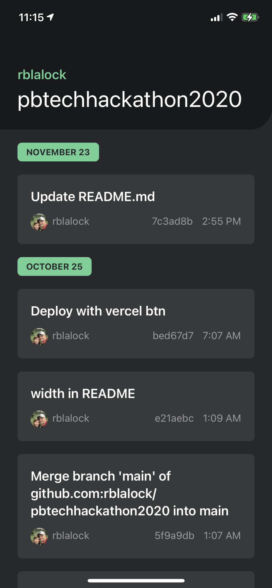

# Friction Log - React Native

Friction logging for React Native by developing a simple application to display GitHub commits.

### Design

https://www.figma.com/file/qSnr405mrrR1yuC9VNHr9R/Friction-Log?node-id=0%3A1

### Next Steps

If we wanted to allow pull-to-refresh or infinite scroll on the list, it would be trivial to add it to the useGitHub hook; but it's out of scope for this demo.

### Running Local

`expo start`

### Screenshot

	

